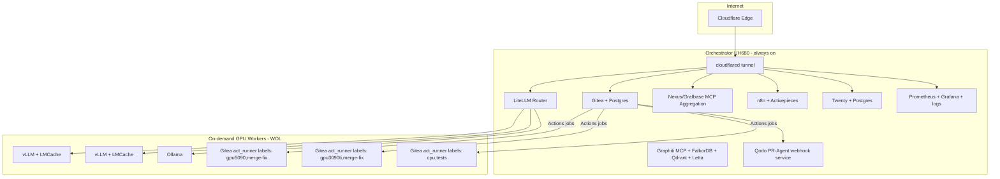
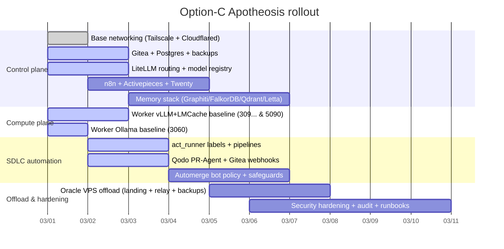

TL;DR
- Build a **control-plane-on-orchestrator** (Gitea+Postgres, LiteLLM routing, MCP aggregation, n8n/Activepieces/Twenty, Graph memory) and a **compute-plane-on-workers** (vLLM+LMCache on 5090/3090Ti; Ollama on 3060), all behind Cloudflared + Tailscale.
- Pick **PostgreSQL for Gitea** (production-friendly; avoid SQLite for growth; database-type switching is risky) and treat Gitea DB as **first-class infra** with backup/restore automation. citeturn0search0turn6search1
- Use **Gitea Actions runners** on each worker with **labels** (gpu5090, gpu3090ti, cpu, merge-fix, tests) + optionally **ephemeral runners** triggered by `workflow_job` events for security hardening and on-demand machines. citeturn0search1
- Add **Qodo Merge / PR-Agent** as a webhook service integrated with Gitea (supported), configured to use **Anthropic Claude models** and optionally repository metadata files like `CLAUDE.MD`. citeturn7search0turn7search3turn7search4
- Standardize local inference behind **OpenAI-compatible endpoints**: vLLM `v1/*` and Ollama `v1/*`, then route everything through LiteLLM. citeturn0search2turn2search0turn5search0
- For persistence on Windows: rely on **Docker restart policies** (`restart: unless-stopped`) + **Docker Desktop autostart** + a **Task Scheduler “compose up”** job; systemd is optional (only if you run daemons inside WSL). citeturn12search3turn12search0
- Offload to Oracle Always Free: keep **PII-heavy** services local; use Oracle for **public landing page**, **artifact/backup relay**, and optionally **webhook relay / CI utilities**; the A1 Always Free pool is **4 OCPUs / 24GB** with **200GB** block storage total. citeturn3search3

# Option‑C Apotheosis Distributed AI Dev Stack for a 4‑PC Windows 11 Docker Desktop Fleet

## Executive summary

Your Project‑Nyra repo already encodes the intended “distributed orchestrator + workers” pattern, with consolidated Docker layouts, Cloudflared routing, and WoL automation scripts (notably the orchestrator + worker deployment script and WoL controller). fileciteturn8file0L24-L76 fileciteturn15file0L36-L63 fileciteturn17file2L65-L123

The most reliable Option‑C architecture is two planes:

- **Control plane (always on, orchestrator)**: Gitea + Postgres, LiteLLM routing, MCP aggregation (Nexus/Grafbase proxy patterns per your design), workflow systems (n8n/Activepieces), CRM (Twenty + Postgres), memory stack (Graphiti/FalkorDB, Letta, Qdrant or ruVector), and observability. Your repo already frames the orchestrator as central coordination and routing. fileciteturn18file1L9-L18 fileciteturn18file2L34-L41
- **Compute plane (on-demand workers)**: vLLM + LMCache on RTX5090 and RTX3090Ti; Ollama on RTX3060; plus Gitea act_runner on each box. This aligns with your repo’s “hybrid approach” guidance: keep the low‑VRAM class on Ollama; use vLLM+LMCache for the higher VRAM workers. fileciteturn17file1L5-L17 fileciteturn17file0L13-L17

For Gitea database choice: **PostgreSQL** is the best fit because (a) you’re already Postgres-forward, (b) it’s a first-class production option in the official docs, and (c) changing DB types later is explicitly discouraged as not well-tested. citeturn0search0turn6search1

For AI-assisted SDLC (PR review → merge fix → tests → automerge), the cleanest “no-magic, high-leverage” chain is:

- **Qodo Merge / PR-Agent** webhook server integrated with Gitea for PR review, descriptions, suggested improvements, and repo-aware context (e.g., `CLAUDE.MD`). citeturn7search0turn7search4
- **Gitea Actions** for deterministic gates (lint/test/security scans) executed on self-hosted runners with labels. citeturn0search1
- A narrow **automerge policy** that only merges when (1) required checks pass, (2) conflicts are absent or resolved by an agent, and (3) the change is within a risk envelope (diff size, file paths, and confidence score), because mortgage/PII workflows demand discipline (that “square and compass” virtue: precision + restraint).

## Topology and rollout plan

### Network and service topology



This matches your repo’s orchestrator-centric pattern (routing, WoL controller, tunnel manager) and worker specialization model. fileciteturn18file1L9-L18 fileciteturn18file0L423-L442

### Rollout timeline (fastest path to “running now”)



## Prioritized checklist to get online immediately

### Environment variables to replace before you run anything

Replace these once (store in Infisical/Bitwarden; do not commit):

- `HF_TOKEN` (HuggingFace weights pull; used by vLLM Docker images) citeturn13search1
- `LITELLM_MASTER_KEY` (LiteLLM API access control) citeturn5search0
- `ANTHROPIC_API_KEY` (Claude access for Qodo and/or agent stack)
- `CLOUDFLARE_TUNNEL_TOKEN` (cloudflared token for remotely managed tunnel) fileciteturn10file0L21-L24
- `GITEA_DB_PASSWORD` (Postgres password for Gitea)
- `GITEA_RUNNER_REG_TOKEN` (Gitea Actions runner registration token) citeturn0search1
- `QODO_GITEA_PAT` + `QODO_WEBHOOK_SECRET` (Qodo PR-Agent Gitea integration) citeturn7search0
- `TWENTY_*` env vars (Twenty self-host compose config variables as per Twenty docs) citeturn10search2
- `N8N_ENCRYPTION_KEY` and Postgres env vars if you move n8n off SQLite citeturn9search6turn9search7

### Quick “is the fabric alive?” checks

- Confirm Docker Desktop GPU support is available (WSL2 backend is required). citeturn1search0  
- Confirm vLLM OpenAI server works on a worker (vLLM OpenAI server doc). citeturn0search2turn13search1  
- Confirm Ollama OpenAI compatibility on the 3060 node. citeturn2search0  
- Confirm cloudflared config routes (your repo already has a working ingress map template, including `git.*` hostname routing to gitea). fileciteturn10file1L63-L67

### “Online now” execution sequence (orchestrator first)

- **Create/verify the shared Docker network** your repo assumes (your cloudflared compose expects an external `nyra-network`). fileciteturn10file0L41-L44  
- Bring up: Postgres, Gitea, LiteLLM, Nexus/MCP aggregator, cloudflared.  
- Then bring up workers: vLLM+LMCache (5090 & 3090Ti) and Ollama (3060).  
- Register Gitea runners and attach labels.

Your repo’s deployment scripts already encode this orchestrator-first then workers approach. fileciteturn15file0L48-L57

## Recommended compose service list and placement

### Placement table

This is the “Option‑C full stack,” but arranged so your **UH680 (16GB RAM)** doesn’t melt. Any heavy nonessential UI can be profiled/disabled.

| Subsystem | Service | Host | Notes |
|---|---|---|---|
| Source control | Gitea | Orchestrator | HTTP behind cloudflared; use HTTPS git operations; SSH is optional via Cloudflare SSH if you insist. fileciteturn10file1L63-L67 citeturn11search1 |
| Gitea DB | Postgres (shared cluster) | Orchestrator | Gitea supports Postgres; don’t plan on DB type switching later. citeturn0search0 |
| CI runners | act_runner | All 3 workers + optional orchestrator | Use labels; optionally ephemeral mode for security. citeturn0search1 |
| PR AI | Qodo PR-Agent | Orchestrator | Runs as webhook server integrated with Gitea. citeturn7search0 |
| LLM routing | LiteLLM | Orchestrator | One OpenAI-compatible gateway to rule them all. citeturn5search0 |
| Local inference | vLLM + LMCache | Worker 5090 + Worker 3090Ti | LMCache quickstart + Redis/Valkey/disk tiers; big wins on repeated context. citeturn1search2turn1search1turn13search0 |
| Dev inference | Ollama | Worker 3060 | OpenAI compatibility for easy routing. citeturn2search0 |
| Memory graph | Graphiti MCP + FalkorDB | Orchestrator | Graphiti MCP server enables persistent graph memory on FalkorDB. citeturn8search0turn9search0 |
| Vector store | Qdrant | Orchestrator | REST 6333, gRPC 6334; use named volumes on Windows if needed. citeturn8search2 |
| Agent memory | Letta | Orchestrator | Docker deployment supported; can use Anthropic + Ollama/vLLM backends. citeturn9search4turn9search3 |
| Workflow | n8n | Orchestrator | Move to Postgres for durability; keep `.n8n` persisted. citeturn9search6turn9search7 |
| Workflow | Activepieces | Orchestrator | For production/multi-instance: Docker Compose with Postgres + Redis. citeturn10search5turn10search6 |
| CRM | Twenty + Postgres | Orchestrator | Self-host supported; follow Docker Compose guide strictly. citeturn10search2 |
| Exposure | cloudflared | Orchestrator | Repo already has a compose + ingress config example. fileciteturn10file0L12-L24 fileciteturn10file1L18-L67 |
| On-demand workers | WoL scripts | Orchestrator | Repo has WoL scripts and a comprehensive guide. fileciteturn17file2L65-L123 fileciteturn18file0L77-L103 |

### Repo-aligned directory convention

Your repo documents a consolidated docker layout (single source of truth under the infra directories) and discourages scattered compose files; use that as the canonical location for new Option‑C overlays. fileciteturn8file0L14-L46

Use a clean overlay structure like:

```text
Project-Nyra/
  infra/
    docker/
      docker-compose.core.yml
      docker-compose.memory.yml
      docker-compose.workflows.yml
      docker-compose.observability.yml
      docker-compose.gitea.yml          # add/restore
      docker-compose.qodo.yml           # add
  infra/
    compose/
      docker-compose.cloudflared.yml    # already exists in repo fileciteturn10file0L8-L26
    compose/configs/cloudflared/config.yml  # already exists fileciteturn10file1L8-L36
  scripts/
    wake-on-lan.ps1                     # already exists fileciteturn17file2L4-L18
```

## Per-worker compose snippets for inference

### Worker 5090 and 3090Ti: vLLM + LMCache (local CPU + disk + optional remote)

Key facts to respect:
- vLLM provides an OpenAI-compatible server (`vllm serve …`). citeturn0search2turn13search1
- LMCache integrates with vLLM using `--kv-transfer-config {"kv_connector":"LMCacheConnectorV1","kv_role":"kv_both"}`. citeturn1search2turn1search1
- LMCache supports **local disk tier** and **remote tier** (Redis or Valkey). citeturn1search6turn1search1turn6search2
- If you want a ready container image, LMCache provides a vLLM-integrated image and documents the required environment variables and command structure. citeturn13search0
- vLLM’s `--gpu-memory-utilization` default is 0.9; tune it to prevent OOM. citeturn6search3

**worker-vllm-lmcache.compose.yml (template)**

```yaml
services:
  lmcache_kv_remote:
    image: valkey/valkey:latest     # optional; can swap to redis:7 if preferred
    container_name: lmcache-kv
    restart: unless-stopped
    ports:
      - "6379:6379"
    command: ["valkey-server", "--save", "", "--appendonly", "no"]
    # For persistence you *could* add volume, but consider RAM pressure.

  vllm:
    # Option A: LMCache integrated image
    image: lmcache/vllm-openai:latest
    # Option B: official vLLM image (then you must install/configure LMCache yourself)
    # image: vllm/vllm-openai:latest
    container_name: vllm-openai
    restart: unless-stopped
    ipc: host   # recommended by vLLM for torch shm usage citeturn13search1
    ports:
      - "8000:8000"
    environment:
      # Replace these:
      - HF_TOKEN=${HF_TOKEN}
      - VLLM_API_KEY=${VLLM_API_KEY:-local-token}

      # LMCache core:
      - LMCACHE_CHUNK_SIZE=256
      - LMCACHE_LOCAL_CPU=True
      - LMCACHE_MAX_LOCAL_CPU_SIZE=8       # GB; tune per worker RAM & load
      - LMCACHE_LOCAL_DISK=file:///cache/lmcache/
      - LMCACHE_MAX_LOCAL_DISK_SIZE=50     # GB; tune per SSD budget

      # Remote (optional):
      - LMCACHE_USE_EXPERIMENTAL=True      # required for V1 remote connectors citeturn1search1
      - LMCACHE_REMOTE_URL=valkey://lmcache_kv_remote:6379
      - LMCACHE_REMOTE_SERDE=naive

    volumes:
      - hf_cache:/root/.cache/huggingface
      - lmcache_disk:/cache/lmcache
    deploy:
      resources:
        reservations:
          devices:
            - driver: nvidia
              count: all
              capabilities: [gpu]

    command:
      - "--model"
      - "${VLLM_MODEL}"
      - "--dtype"
      - "auto"
      - "--api-key"
      - "${VLLM_API_KEY:-local-token}"
      - "--gpu-memory-utilization"
      - "${VLLM_GPU_MEM_UTIL:-0.92}"
      - "--max-model-len"
      - "${VLLM_MAX_MODEL_LEN:-16384}"
      - "--kv-transfer-config"
      - '{"kv_connector":"LMCacheConnectorV1","kv_role":"kv_both"}'

volumes:
  hf_cache:
  lmcache_disk:
```

**Worker-specific recommended defaults**
- 5090 (24GB VRAM): start with `VLLM_GPU_MEM_UTIL=0.90–0.92`, `VLLM_MAX_MODEL_LEN=8192–16384`, local disk tier enabled for persistence. (vLLM memory utilization tuning is explicitly supported by the CLI.) citeturn6search3
- 3090Ti (24GB VRAM): similar to 5090; you can give it “merge-fix” workloads and bigger CPU/disk cache since it has 32GB system RAM.

### Worker 3060: Ollama (OpenAI compatible)

Ollama provides OpenAI-compatible endpoints at `http://localhost:11434/v1/…`, and the API key is required by clients but is ignored by Ollama. citeturn2search0

**worker-ollama.compose.yml (template)**

```yaml
services:
  ollama:
    image: ollama/ollama:latest
    container_name: ollama
    restart: unless-stopped
    ports:
      - "11434:11434"
    volumes:
      - ollama_models:/root/.ollama
    deploy:
      resources:
        reservations:
          devices:
            - driver: nvidia
              count: all
              capabilities: [gpu]

volumes:
  ollama_models:
```

**Why keep Ollama on the 3060?**  
Your repo’s vLLM migration guide explicitly recommends a hybrid approach: keep the constrained GPU on Ollama; migrate the higher-VRAM workers to vLLM for LMCache benefits. fileciteturn17file1L5-L17

## Gitea, runners, and AI-assisted SDLC automation

### Gitea database choice

Use **PostgreSQL**:
- Gitea supports Postgres (>=12) and it’s one of the two DB engines the docs focus on for production setups. citeturn0search0
- SQLite “does not scale,” and conversion between DB types is explicitly considered not well-tested; choose the final DB up front. citeturn0search0turn6search1
- Postgres auth hardening: prefer SCRAM-SHA-256 over MD5. citeturn0search0

### Gitea backup/restore

- Gitea provides a `dump` command, but the docs caution that native DB dumps (pg_dump/mysqldump) may be preferred due to known issues with the XORM dump path. citeturn6search1
- Backups should be taken with Gitea stopped to avoid inconsistent DB vs repo states. citeturn6search1

### act_runner strategy and labels

Gitea act_runner supports:
- Interactive and non-interactive registration, including `--labels`. citeturn0search1
- **Ephemeral runners** (act_runner 0.2.12+), designed so credentials are revoked after a single job; Gitea recommends using the `workflow_job` webhook to automate ephemeral runner lifecycle. citeturn0search1

**Recommended runner labels (map to your hardware + workflows)**

| Machine | Labels | Use |
|---|---|---|
| Orchestrator | `linux_amd64:host, cpu, lightweight` | formatting, docs, small builds |
| 3060 worker | `linux_amd64, gpu3060, tests` | unit tests, lint, small model checks |
| 3090Ti worker | `linux_amd64, gpu3090ti, merge-fix` | conflict resolution agent jobs + heavy test runs |
| 5090 worker | `linux_amd64, gpu5090, inference, merge-fix` | heavy AI jobs (test-gen, refactor, AI CI) |

### Runner registration scripts (PowerShell)

These mirror Gitea’s documented non-interactive registration pattern. citeturn0search1

**register-runner.ps1 (template)**

```powershell
param(
  [Parameter(Mandatory=$true)][string]$InstanceUrl,
  [Parameter(Mandatory=$true)][string]$Token,
  [Parameter(Mandatory=$true)][string]$Name,
  [Parameter(Mandatory=$true)][string]$Labels,
  [string]$RunnerDir = "C:\Dev\Nyra\act-runner"
)

New-Item -ItemType Directory -Force -Path $RunnerDir | Out-Null
Set-Location $RunnerDir

# Assumes you run act_runner in Docker (recommended) OR you have the binary extracted here.
# For Docker runner usage, set env vars as in Gitea docs.
Write-Host "Register act_runner (non-interactive)..."
Write-Host "Instance: $InstanceUrl"
Write-Host "Name: $Name"
Write-Host "Labels: $Labels"

# If using binary:
# .\act_runner.exe register --no-interactive --instance $InstanceUrl --token $Token --name $Name --labels $Labels

# If using docker:
$env:INSTANCE_URL = $InstanceUrl
$env:REGISTRATION_TOKEN = $Token
$env:RUNNER_NAME = $Name
$env:RUNNER_LABELS = $Labels

docker compose up -d
```

### Qodo Merge (PR-Agent) integration with Gitea

Qodo provides a dedicated **Gitea installation guide**:
- Create a bot user in Gitea, generate a PAT with `api` access, generate a webhook secret, run PR-Agent as a webhook server, and configure the repo webhook endpoint `/api/v1/gitea_webhooks`. citeturn7search0
- It supports selecting Anthropic Claude models in config. citeturn7search3
- It can auto-read repo metadata files like `CLAUDE.MD` (and others) if enabled. citeturn7search4

**Minimal Qodo webhook service compose (orchestrator)**

```yaml
services:
  qodo_pr_agent:
    image: codiumai/pr-agent:latest
    container_name: qodo-pr-agent
    restart: unless-stopped
    environment:
      # Replace these:
      - CONFIG__GIT_PROVIDER=gitea
      - GITEA__URL=http://gitea:3000
      - GITEA__PERSONAL_ACCESS_TOKEN=${QODO_GITEA_PAT}
      - GITEA__WEBHOOK_SECRET=${QODO_WEBHOOK_SECRET}
      - OPENAI__KEY=${OPENAI_API_KEY:-}          # if you use OpenAI
      - ANTHROPIC__KEY=${ANTHROPIC_API_KEY:-}    # if you use Claude (recommended)
    networks:
      - nyra-network

networks:
  nyra-network:
    external: true
```

Then, inside Gitea, create a webhook pointing to:
- `http://qodo-pr-agent:3000/api/v1/gitea_webhooks` (internal docker network URL), with triggers for push/comments/PR events as Qodo recommends. citeturn7search0

### Example Gitea Actions workflow: AI review → merge fixer → automerge

This is a pragmatic “confidence policy” design:
- Always run tests.
- Only automerge when risk is low and checks pass.
- If merge conflict is detected, route to a merge-fix job (3090Ti/5090 label) before re-running tests.

**.gitea/workflows/ai_pr_pipeline.yml**

```yaml
name: AI PR Pipeline

on:
  pull_request:
    types: [opened, synchronize, reopened]
  issue_comment:
    types: [created]

jobs:
  qodo_review:
    if: github.event_name == 'pull_request'
    runs-on: [linux_amd64]
    steps:
      - name: Trigger Qodo review (via PR comment)
        run: |
          echo "In Gitea, you can post a comment like /review to trigger Qodo."
          # Prefer: let Qodo webhook react automatically.
          # Or: call Qodo API if you expose it internally.

  tests:
    runs-on: [linux_amd64, tests]
    steps:
      - uses: actions/checkout@v4
      - name: Run unit tests
        run: |
          ./scripts/run-tests.sh

  merge_fix:
    needs: [tests]
    if: contains(github.event.pull_request.labels.*.name, 'needs-merge-fix')
    runs-on: [linux_amd64, merge-fix]
    steps:
      - uses: actions/checkout@v4
      - name: Attempt auto-merge resolution
        run: |
          ./scripts/ai/merge_fix.sh

  automerge:
    needs: [tests]
    if: contains(github.event.pull_request.labels.*.name, 'ai-automerge')
    runs-on: [linux_amd64]
    steps:
      - name: Merge if checks passed
        run: |
          echo "Use Gitea API to merge only if required checks pass."
```

**Why not let AI merge everything?**  
Because your domain includes mortgage workflows + borrower data. The “confidence policy” should restrict AI merges to low-risk zones unless a human explicitly grants a higher-risk permission (label + reviewer approval).

A minimal confidence envelope:

| Gate | Required? | Implementation idea |
|---|---|---|
| Tests pass | Yes | Gitea Actions job status required |
| Diff size cap | Yes | deny automerge if too many files/LOC |
| Forbidden paths | Yes | block `infra/*`, DB migrations, auth code without human |
| AI confidence score | Yes | require Qodo / reviewer score above threshold |
| Human “blessing label” | Yes | `ai-automerge` applied by maintainer only |

## Cloudflared, Tailscale, persistence, Oracle offload, and security

### Cloudflared tunnel patterns

Your repo already includes:
- A cloudflared compose that runs `tunnel --config … run` and passes `CLOUDFLARE_TUNNEL_TOKEN` as env var. fileciteturn10file0L12-L24
- An ingress config mapping hostnames to internal services, including a `git.*` hostname routed to the gitea service. fileciteturn10file1L18-L67

Official Cloudflare docs confirm:
- How to create locally-managed tunnels and configure `config.yml`. citeturn2search2turn11search9
- That you should protect self-hosted apps with Access and validate tokens (or enable “Protect with Access”). citeturn3search0turn3search5

**SSH git over Cloudflare (optional)**  
If you insist on SSH git operations, Cloudflare documents the client-side `ProxyCommand cloudflared access ssh --hostname %h` approach. citeturn11search1  
(Recommendation: prefer HTTPS git operations through the tunnel unless you have a strong reason to maintain SSH.)

### Tailscale + Wake-on-LAN reality check

Tailscale operates at Layer 3; WoL magic packets are Layer 2, so Tailscale can’t directly deliver WoL without an on-LAN relay pattern. citeturn1search5  
Your repo already provides a WoL management system (scripts + config + troubleshooting) and emphasizes broadcast addresses and NIC/BIOS configuration. fileciteturn18file0L44-L49 fileciteturn18file0L77-L103

### Windows persistence: Docker + restart + Task Scheduler

- Compose supports `restart: unless-stopped`. citeturn12search3
- If you need Linux daemons under WSL (e.g., tailscaled/cloudflared installed *inside* WSL), enable systemd via `/etc/wsl.conf` (`[boot] systemd=true`). citeturn12search0  
Your repo includes a WSL orchestrator setup guide and a wsl.conf template enabling systemd. fileciteturn11file0L131-L145 fileciteturn11file1L15-L18

**Practical recommendation for your setup**
- Run **Tailscale as a Windows service** (you already do).
- Run **cloudflared as a Docker container** (as in your repo), or as a Windows service if you want even tighter boot reliability. Cloudflare explicitly supports running cloudflared as a service on Windows. citeturn11search4turn11search0
- For Docker stacks: use restart policies + a scheduled task that runs `docker compose up -d` on startup/login.

**Task Scheduler creation (PowerShell template)**

```powershell
$Action = New-ScheduledTaskAction -Execute "PowerShell.exe" -Argument "-NoProfile -ExecutionPolicy Bypass -File C:\Dev\Nyra\orchestrator\start.ps1"
$Trigger = New-ScheduledTaskTrigger -AtStartup
Register-ScheduledTask -TaskName "Nyra-Orchestrator-ComposeUp" -Action $Action -Trigger $Trigger -RunLevel Highest -Force
```

### Oracle VPS offload plan

Oracle Always Free resources (per official docs):
- A1 Flex Always Free is equivalent to **4 OCPUs and 24 GB memory**, and you have **200 GB** Always Free block volume total. citeturn3search3

**What to offload there (recommended)**
- **Public landing page + marketing site** (no borrower PII).
- **Webhook relay / public edge utilities**: e.g., a small service that receives public webhooks and forwards into your tailnet (if needed).
- **Artifact backups**: encrypted offsite copies of Gitea dumps and Postgres logical backups (do not store plaintext secrets).

**What not to offload by default**
- TwentyCRM DB and borrower docs (high PII concentration) unless you have a mature encryption + access + audit program and you intentionally want cloud residency.

### Security checklist (PII-aware)

- **Secrets hygiene**: keep all API keys, DB passwords, webhook secrets out of git. Your repo already emphasizes secrets tooling (Infisical integration guide exists). fileciteturn11file2L5-L10
- **Cloudflare Access**: require identity auth for dashboards and admin apps; validate Access tokens or enable tunnel “Protect with Access.” citeturn3search0turn3search5
- **Runner trust model**: prefer ephemeral runners for untrusted code paths (credentials revoked after job assignment). citeturn0search1
- **Network segmentation**: keep DB ports private; expose only via cloudflared hostnames; do not bind Postgres to 0.0.0.0 unless necessary. (Gitea DB prep docs explicitly discuss listen/bind and security posture.) citeturn0search0
- **Backups**: automate, encrypt, test restore monthly. Gitea backup docs emphasize consistency (stop during backup). citeturn6search1
- **Observability redaction**: avoid logging payloads containing borrower identifiers; if you must, mask & rotate.

### Troubleshooting and monitoring

- vLLM basic validation: call the OpenAI-compatible API (`/v1/chat/completions`) per docs. citeturn0search2  
- vLLM OOM: lower `--gpu-memory-utilization`, reduce `--max-model-len` (both are documented CLI options). citeturn6search3
- LMCache validation: start with LMCache quickstart config, keep chunk size at 256 for production (LMCache docs default). citeturn1search2turn1search1
- Qdrant validation: confirm ports 6333/6334 and mount storage; Qdrant docs note Windows may prefer named volumes. citeturn8search2
- WoL failures: your repo’s WoL guide covers BIOS, NIC settings, disabling Fast Startup, and the broadcast/port model. fileciteturn18file0L77-L109
- Docker GPU issues: Docker Desktop GPU support requires WSL2 backend + current NVIDIA drivers. citeturn1search0

Useful commands (copy/paste friendly):

```powershell
# Check containers
docker ps
docker compose ls

# Logs
docker logs -f <container>

# GPU visibility (inside a CUDA container)
docker run --rm --gpus all nvidia/cuda:12.4.1-base-ubuntu22.04 nvidia-smi
```

```bash
# cloudflared tunnel debugging
cloudflared tunnel list
cloudflared tunnel info <NAME_OR_UUID>   # Cloudflare docs mention tunnel info usage citeturn2search2
```

### Optional upgrades

- Switch LMCache remote backend from Redis to **Valkey** (LMCache documents Valkey support and notes pipelining that can improve RTT vs Redis connector). citeturn6search2
- Add a “wake-on-workflow_job” controller: when Gitea emits `workflow_job`, orchestrator wakes the right worker and registers an ephemeral runner (security-hardening pattern). citeturn0search1turn1search5
- Add Graphiti MCP server + FalkorDB Browser UI for a “memory observatory” (Graphiti MCP server quickstart is documented; FalkorDB provides docker images and ports). citeturn8search0turn9search0