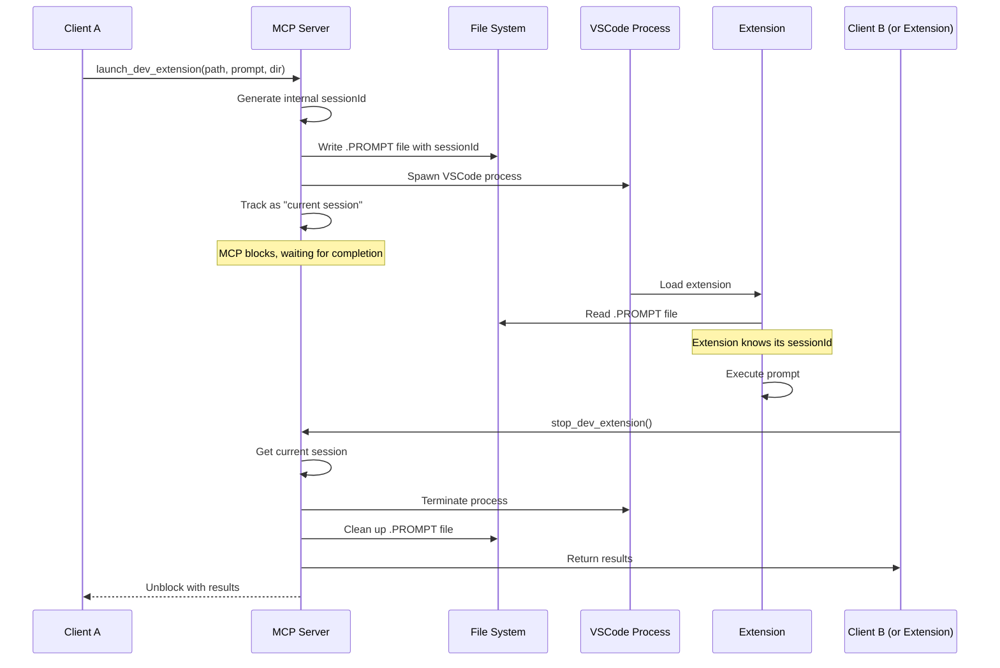

# VSCode Extension Testing Tools

This document outlines the implementation plan for MCP tools that enable testing of VSCode extensions.

## Overview

These tools allow AI agents to test VSCode extensions by launching them in development mode with specific test prompts. The extension will automatically execute the prompt and can be terminated when testing is complete.

## Architecture



## File Structure

```
src/tools/vscode-extension-testing/
├── launchDevExtension.ts
├── stopDevExtension.ts
├── extensionManager.ts
├── types.ts
└── README.md
```

## Core Components

### 1. Types

```typescript
// types.ts
interface ExtensionProcess {
  sessionId: string;
  extensionPath: string;
  testDir: string;
  prompt: string;
  startTime: Date;
  process: ChildProcess;
  pid?: number;
}

interface LaunchDevExtensionArgs {
  workspaceDir: string;
  prompt: string;
}

interface StopDevExtensionArgs {
  // No arguments needed - stops the current session
}

interface PromptFile {
  sessionId: string;
  prompt: string;
  startTime: string;
  extensionPath: string;
}
```

### 2. Extension Manager

The `ExtensionManager` is a singleton class that manages the lifecycle of extension test processes:

```typescript
// extensionManager.ts
class ExtensionManager {
  private static instance: ExtensionManager;
  public sessions: Map<string, ExtensionProcess>;
  public currentSessionId: string | null = null;
  private sessionCompletionCallbacks: Map<string, (result: StopResult) => void>;
  
  private constructor() {
    this.sessions = new Map();
    this.sessionCompletionCallbacks = new Map();
  }
  
  static getInstance(): ExtensionManager {
    if (!ExtensionManager.instance) {
      ExtensionManager.instance = new ExtensionManager();
    }
    return ExtensionManager.instance;
  }
  
  private generateSessionId(): string {
    return `test-${Math.random().toString(36).substring(2, 10)}`;
  }
  
  launchExtension(extensionPath: string, prompt: string, dir: string): string {
    const sessionId = this.generateSessionId();
    
    // Create prompt file
    // Launch VSCode process
    // Track session
    
    this.currentSessionId = sessionId;
    return sessionId;
  }
  
  getCurrentSession(): ExtensionProcess | undefined {
    if (!this.currentSessionId) return undefined;
    return this.sessions.get(this.currentSessionId);
  }
  
  stopCurrentSession(): StopResult | undefined {
    const session = this.getCurrentSession();
    if (session) {
      // Stop the process
      // Clean up resources
      // Signal completion to any waiting callbacks
    }
    return result;
  }
  
  waitForSessionCompletion(sessionId: string): Promise<StopResult> {
    return new Promise<StopResult>((resolve) => {
      // Store callback to be called when session completes
      this.sessionCompletionCallbacks.set(sessionId, resolve);
    });
  }
}
```

### 3. Launch Tool

```typescript
// launchDevExtension.ts
class LaunchDevExtensionTool implements ToolHandler {
  name = "launch_dev_extension";
  description = "Launch a VSCode extension in development mode with a test prompt";
  inputSchema = {
    type: "object",
    properties: {
      workspaceDir: {
        type: "string",
        description: "Path to the workspace directory containing the extension",
      },
      prompt: {
        type: "string",
        description: "The prompt to execute in the extension",
      },
    },
    required: ["workspaceDir", "prompt"],
  };

  async execute(args: LaunchDevExtensionArgs, context: Context): Promise<McpToolCallResponse> {
    try {
      // Validate inputs
      // Derive extension path as <workspaceDir>/src
      // Derive test directory as <workspaceDir>/examples
      // Get extension manager
      // Launch extension
      
      // Wait for the extension process to complete or be stopped
      // This will block until stopDevExtension is called or the process exits
      const result = await manager.waitForSessionCompletion(sessionId);
      
      return {
        content: [
          {
            type: "text",
            text: `VSCode extension test completed in ${durationSeconds} seconds with exit code ${result.exitCode ?? 'unknown'}.\n\nResults:\n${truncatedText}`,
          },
        ],
      };
    } catch (error) {
      // Handle errors
    }
  }
}
```

### 4. Stop Tool

```typescript
// stopDevExtension.ts
class StopDevExtensionTool implements ToolHandler {
  name = "stop_dev_extension";
  description = "Stop the currently running VSCode extension test";
  inputSchema = {
    type: "object",
    properties: {},
    required: [],
  };

  async execute(args: StopDevExtensionArgs, context: Context): Promise<McpToolCallResponse> {
    try {
      // Get extension manager
      // Stop current session
      // Collect results
      
      return {
        content: [
          {
            type: "text",
            text: `VSCode extension test stopped. Test ran for ${duration} seconds. Results: ${results}`,
          },
        ],
      };
    } catch (error) {
      // Handle errors
    }
  }
}
```

## Error Handling

- File system errors: Permission issues, disk space
- Process errors: VSCode not found, extension path invalid
- Timeout handling: Max execution time limits
- Resource cleanup: Always clean up files and processes

## Security Considerations

- Validate all file paths to prevent directory traversal
- Limit concurrent processes to prevent resource exhaustion
- Sanitize prompt content before writing to file
- Run processes with minimal privileges

## Integration Steps

1. Create the new tool files in the structure above
2. Import tools in `src/tools/index.ts`
3. Add to the `allTools` array
4. Test with a simple VSCode extension

## Example Usage

### Scenario 1: Client A launches extension, Client B stops it

```typescript
// Client A calls launch tool (this call blocks)
{
  "tool": "launch_dev_extension",
  "arguments": {
    "workspaceDir": "/path/to/my-extension-workspace",
    "prompt": "Create a new TypeScript file with a hello world function"
  }
}

// Later, Client B calls stop tool
{
  "tool": "stop_dev_extension",
  "arguments": {}
}

// Client A's call unblocks and returns results
```

### Scenario 2: Extension stops itself

```typescript
// Client calls launch tool (this call blocks)
{
  "tool": "launch_dev_extension",
  "arguments": {
    "workspaceDir": "/path/to/my-extension-workspace",
    "prompt": "Create a new TypeScript file with a hello world function"
  }
}

// The extension reads the prompt file, executes the prompt,
// and when done, it calls stop_dev_extension via the MCP protocol

// Client's call unblocks and returns results