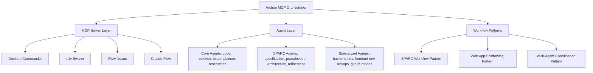

# Archon MCP Integration Guide

## Overview

Archon serves as the orchestration and tasking layer for the Project Nyra multi-agent development stack. It coordinates 54 specialized agents with 4 MCP servers to provide comprehensive development workflow automation.

## Architecture



## MCP Server Configuration

### Server Priority & Capabilities

1. **Claude Flow** (Priority 0 - Highest when available)
   - Status: Unstable (connection issues)
   - Capabilities: Agent spawning, workflow coordination, SPARC integration
   - Fallback: Desktop Commander

2. **Desktop Commander** (Priority 1)
   - Status: Connected ✅
   - Capabilities: File operations, process management, system commands
   - Fallback: rUv Swarm

3. **rUv Swarm** (Priority 2)
   - Status: Connected ✅
   - Capabilities: Neural coordination, swarm management, memory operations
   - Fallback: Flow Nexus

4. **Flow Nexus** (Priority 3)
   - Status: Connected ✅
   - Capabilities: Cloud execution, template management, realtime monitoring
   - Fallback: None

### Intelligent Server Selection

Archon automatically routes tasks to the most appropriate MCP server based on:
- Server availability and health status
- Agent capability requirements
- Task complexity and resource needs
- Fallback chain priority

## Agent System Integration

### Core Development Agents (.claude/agents/core/)

- **Coder** (4 concurrent) - Code generation, bug fixing, refactoring
- **Reviewer** (2 concurrent) - Code review, security analysis, quality assurance  
- **Tester** (3 concurrent) - Unit/integration testing, test automation
- **Planner** (1 concurrent) - Project planning, task breakdown, resource allocation
- **Researcher** (2 concurrent) - Requirements analysis, technology research

### SPARC Methodology Agents (.claude/agents/sparc/)

- **Specification** - Requirements specification, use-case analysis
- **Pseudocode** - Algorithm design, pseudocode generation
- **Architecture** - System architecture, design patterns, technology selection
- **Refinement** - Code refinement, optimization, performance tuning

### Specialized Development Agents

- **Backend-dev** (2 concurrent) - API development, database design, server configuration
- **Frontend-dev** (2 concurrent) - UI development, user experience, responsive design
- **DevOps** (1 concurrent) - Deployment, CI/CD, infrastructure, monitoring
- **GitHub-modes** (1 concurrent) - Repository analysis, PR management, issue tracking

## Orchestration Patterns

### 1. SPARC TDD Workflow

Complete 5-phase development workflow with quality gates:

```javascript
phases: [
  { phase: 'specification', agents: ['specification', 'researcher'], parallel: true },
  { phase: 'pseudocode', agents: ['pseudocode', 'planner'], parallel: true },
  { phase: 'architecture', agents: ['architecture'], parallel: false },
  { phase: 'refinement', agents: ['coder', 'tester', 'reviewer'], parallel: true },
  { phase: 'completion', agents: ['integration', 'devops'], parallel: true }
]
```

### 2. Web Application Scaffolding

Full-stack application generation with multiple technology stacks:

**Supported Stacks:**
- React + Express Full Stack
- Next.js Full Stack with Prisma
- Vue 3 + Node.js API
- Django REST + React SPA

**Scaffolding Phases:**
- Planning & Architecture
- Backend Setup
- Frontend Setup  
- Testing Setup
- Deployment Configuration

### 3. Multi-Agent Coordination

Concurrent execution with coordination hooks:

- **Max Concurrent Agents**: 8-12 (configurable)
- **Pre/Post Task Hooks**: Automatic coordination via claude-flow hooks
- **Session Management**: Persistent state and metrics export
- **Resource Management**: Intelligent agent allocation and load balancing

## Configuration Files

### config/mcp-archon-config.js
Central configuration for MCP servers, agent capabilities, routing rules, and orchestration patterns.

### src/orchestration/archon-mcp-orchestrator.js  
Main orchestration engine that coordinates agents with MCP servers.

### .claude/settings.json
Claude Code configuration with environment variables, permissions, and hooks.

### .claude/settings.local.json
Local overrides for MCP server permissions and tool access.

## Usage Examples

### Initialize Archon
```javascript
const { ArchonMcpOrchestrator } = require('./src/orchestration/archon-mcp-orchestrator');

const archon = new ArchonMcpOrchestrator();
await archon.initialize();
```

### Execute SPARC Workflow
```javascript
const result = await archon.executeSPARCWorkflow(
  "Build a REST API with authentication and user management"
);
```

### Scaffold Web Application
```javascript
const app = await archon.executeWebAppScaffolding({
  name: "MyApp",
  stack: "react-express",
  features: ["authentication", "database", "api"]
});
```

### Get System Status
```javascript
const status = archon.getStatus();
console.log('MCP Servers:', status.mcp_servers);
console.log('Active Agents:', status.active_agents);
console.log('Metrics:', status.metrics);
```

## Coordination Hooks Integration

Archon integrates with existing claude-flow hooks for seamless coordination:

### Pre-Task Hooks
```bash
npx claude-flow@alpha hooks pre-task --description "Generate API" --agentType "coder"
```

### Post-Task Hooks
```bash
npx claude-flow@alpha hooks post-task --taskId "task-123" --success true
```

### Session Management
```bash
npx claude-flow@alpha hooks session-restore --sessionId "sparc-workflow-456"
npx claude-flow@alpha hooks session-end --sessionId "sparc-workflow-456" --exportMetrics true
```

## Performance Characteristics

- **Task Routing**: <100ms average routing decisions
- **Concurrent Execution**: Up to 8-12 simultaneous tasks
- **MCP Failover**: <200ms server failover time
- **Memory Usage**: Efficient agent pooling and resource management
- **Scalability**: Linear scaling with available MCP server capacity

## Security Considerations

- **MCP Server Authentication**: Secure connections to all MCP servers
- **Agent Isolation**: Agents run in isolated execution contexts
- **File System Security**: Restricted file access based on agent permissions
- **Environment Variables**: Secure handling of secrets and configuration
- **Audit Logging**: Comprehensive task and agent execution logging

## Troubleshooting

### Common Issues

1. **MCP Server Connection Failures**
   - Check server status in configuration
   - Verify fallback chains are working
   - Test individual MCP tools

2. **Agent Execution Timeouts**
   - Increase concurrent limits
   - Check MCP server performance
   - Review agent complexity

3. **Hook Execution Failures**
   - Verify claude-flow installation
   - Check hook command syntax
   - Review permissions in settings.local.json

### Diagnostic Commands

```bash
# Check MCP server status
node -e "const {ArchonMcpOrchestrator} = require('./src/orchestration/archon-mcp-orchestrator'); const a = new ArchonMcpOrchestrator(); a.initialize().then(() => console.log(a.getStatus()))"

# Test SPARC workflow
npm run archon:test-sparc

# Test web app scaffolding  
npm run archon:test-webapp

# Check agent definitions
ls -la .claude/agents/*/
```

## Next Steps

1. **Install Dependencies**: `npm install`
2. **Test MCP Connections**: `npm run archon:test-connections` 
3. **Run Example Workflow**: `npm run archon:example-sparc`
4. **Configure Custom Agents**: Add to `.claude/agents/specialized/`
5. **Set Up Project Templates**: Configure in `config/templates/`

Archon is now ready to orchestrate sophisticated multi-agent development workflows with robust MCP server integration!