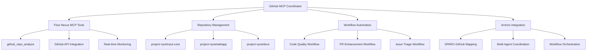

# GitHub MCP Integration Guide

## Overview

The GitHub MCP Integration provides comprehensive GitHub repository management through Flow Nexus MCP tools, seamlessly coordinating with Archon's multi-agent orchestration system.

## Features

🔍 **Repository Analysis**
- Code quality assessment
- Security vulnerability scanning  
- Performance analysis
- Technical debt evaluation

⚙️ **Workflow Automation**
- Automated code quality checks
- PR enhancement workflows
- Issue triage automation
- Release management

🤖 **Multi-Agent Coordination**
- Agent-specific GitHub operations
- SPARC methodology integration
- Archon orchestration coordination

## Architecture



## Repository Configuration

### Primary Repository: project-nyra/nyra-core
```javascript
{
  name: 'Nyra Core',
  description: 'Core orchestration and multi-agent development stack',
  components: {
    'claude-flow': 'Claude Flow orchestration layer',
    'nyra-orchestration/archon': 'Archon MCP orchestration system',
    'repo-agent': 'Repository management agent'
  },
  automation_enabled: true
}
```

### Supported Repositories
1. **project-nyra/nyra-core** - Core orchestration system
2. **project-nyra/webapp** - Web application frontend/backend
3. **project-nyra/docs** - Project documentation

## Workflow Automation

### 1. Code Quality Check Workflow

**Trigger**: On every push to repository
**Steps**:
1. Repository Analysis (code quality)
2. Security Scan (vulnerability detection)  
3. Performance Analysis (optimization recommendations)

**Actions**:
- Create quality report
- Generate security issues for vulnerabilities
- Add performance suggestions as PR comments

### 2. PR Enhancement Workflow

**Trigger**: On pull request creation
**Steps**:
1. Code Review Analysis
2. Test Coverage Verification (80% threshold)
3. Documentation Update Check

**Actions**:
- Auto-comment on PR with analysis
- Set status checks for coverage
- Suggest documentation improvements

### 3. Issue Triage Workflow

**Trigger**: On new issue creation
**Steps**:
1. Issue Classification (bug/feature/enhancement/docs)
2. Priority Assessment (low/medium/high/critical)
3. Team Assignment (backend/frontend/devops/docs)

**Actions**:
- Auto-label issues by category
- Auto-assign based on priority
- Route to appropriate team

## Integration Patterns

### Archon-GitHub Coordination

**SPARC Phase Mappings**:
```javascript
{
  'specification': {
    github_actions: ['create_issues', 'milestone_planning', 'requirements_documentation'],
    automation: 'auto_create_project_board'
  },
  'pseudocode': {
    github_actions: ['create_algorithm_branches', 'draft_implementation_plan'],
    automation: 'link_issues_to_pseudocode'  
  },
  'architecture': {
    github_actions: ['create_architecture_docs', 'system_design_prs'],
    automation: 'generate_architecture_diagrams'
  },
  'refinement': {
    github_actions: ['implementation_prs', 'code_reviews', 'testing'],
    automation: 'continuous_integration'
  },
  'completion': {
    github_actions: ['merge_to_main', 'create_release', 'deployment'],
    automation: 'automated_deployment'
  }
}
```

### Multi-Agent GitHub Operations

**Agent Responsibilities**:
- **Coder**: Code commits, branch management, merge conflicts
- **Reviewer**: PR reviews, code analysis, security checks  
- **Tester**: Test validation, coverage reports, CI status
- **Documenter**: README updates, changelog, API docs
- **DevOps**: Deployment, releases, infrastructure

## Analysis Types

### Code Quality Analysis
- **Metrics**: Complexity, duplication, maintainability, technical debt
- **Thresholds**: Complexity <10, Duplication <5%, Maintainability >B
- **Automation**: Create quality reports with recommendations

### Security Analysis  
- **Checks**: Vulnerabilities, secrets, dependencies, permissions
- **Severity**: Low/Medium/High/Critical
- **Automation**: Create security issues for findings

### Performance Analysis
- **Metrics**: Load time, memory usage, CPU utilization
- **Benchmarks**: Load time <2s, Memory <500MB, CPU <80%
- **Automation**: Performance optimization suggestions

## Usage Examples

### Initialize GitHub Coordinator
```javascript
const { GitHubMcpCoordinator } = require('./src/coordination/github-mcp-coordinator');

const coordinator = new GitHubMcpCoordinator();
await coordinator.initialize();
```

### Analyze Repository
```javascript
const analysis = await coordinator.analyzeRepository(
  'project-nyra/nyra-core', 
  'code_quality'
);
console.log('Analysis ID:', analysis.analysisId);
```

### Execute Workflow
```javascript
const workflow = await coordinator.executeWorkflow(
  'code_quality_check',
  'project-nyra/nyra-core',
  { branch: 'main', author: 'developer' }
);
```

### Create Issue
```javascript
const issue = await coordinator.createIssue('project-nyra/nyra-core', {
  title: 'Performance Optimization Required',
  body: 'Analysis shows load time exceeds 2s threshold',
  labels: ['performance', 'optimization'],
  assignees: ['devops-team']
});
```

### Integration with Archon
```javascript
const result = await coordinator.integrateWithArchon('sparc-workflow-123', [
  {
    type: 'analyze_repository',
    repository: 'project-nyra/nyra-core',
    analysis_type: 'code_quality'
  },
  {
    type: 'execute_workflow', 
    workflow: 'pr_enhancement',
    repository: 'project-nyra/nyra-core',
    context: { pr_number: 45 }
  }
]);
```

## MCP Tool Integration

### Flow Nexus GitHub Tools
```javascript
// Repository Analysis
mcp__flow-nexus__github_repo_analyze({
  repo: 'project-nyra/nyra-core',
  analysis_type: 'code_quality'
})

// Get Analysis Status (coming soon)
mcp__flow-nexus__github_analysis_status({
  analysis_id: 'analysis-123'
})

// Create Issue (via Flow Nexus GitHub integration)
flow-nexus-github-create-issue({
  repo: 'project-nyra/nyra-core',
  title: 'Issue Title',
  body: 'Issue Description'
})
```

### Authentication
Uses Flow Nexus authenticated session:
- User: edaneandersen@gmail.com
- Credits: 256 initial credits
- Session: Active with persistent token

## Monitoring and Metrics

### Coordinator Status
```javascript
const status = coordinator.getStatus();
// Returns:
// - Active analyses count
// - Workflow execution history
// - Performance metrics
// - Repository summary
// - Recent workflows
```

### Performance Metrics
- **Analyses Completed**: Total repository analyses
- **Issues Created**: Auto-generated issues
- **PRs Managed**: Pull requests processed
- **Workflows Executed**: Automation workflows run

## Configuration Files

### config/github-mcp-config.js
Central configuration for repositories, workflows, integration patterns, and analysis types.

### src/coordination/github-mcp-coordinator.js
Main coordinator class handling GitHub operations via MCP tools.

## Error Handling

### Analysis Failures
- Retry mechanism with exponential backoff
- Fallback to manual analysis
- Error logging and notification

### Workflow Failures
- Step-by-step failure handling
- Configurable failure actions (continue/stop/create_issue)
- Rollback capabilities for critical failures

### Integration Failures
- Graceful degradation when GitHub unavailable
- Queue operations for retry when connection restored
- Alert mechanisms for persistent failures

## Security Considerations

### Access Control
- Repository access controlled by Flow Nexus authentication
- Team-based permissions for different operations
- Audit logging for all GitHub operations

### Data Privacy
- No sensitive data stored in analysis results
- Secure token handling for GitHub API
- Encrypted storage for configuration data

## Future Enhancements

1. **Advanced Analytics**
   - Trend analysis over time
   - Predictive quality metrics
   - Performance regression detection

2. **Enhanced Automation**
   - AI-powered code review comments
   - Automated refactoring suggestions
   - Smart merge conflict resolution

3. **Extended Integration**
   - GitLab and Bitbucket support
   - Slack/Discord notifications
   - JIRA issue synchronization

## Troubleshooting

### Common Issues

1. **Analysis Timeout**
   ```bash
   # Check analysis status
   node -e "const c = new (require('./src/coordination/github-mcp-coordinator').GitHubMcpCoordinator)(); c.getAnalysisResult('analysis-id')"
   ```

2. **Workflow Execution Failures**
   ```bash
   # Check workflow history
   node -e "const c = new (require('./src/coordination/github-mcp-coordinator').GitHubMcpCoordinator)(); console.log(c.getWorkflowHistory(5))"
   ```

3. **MCP Tool Connectivity**
   ```bash
   # Test Flow Nexus connection
   claude mcp list | grep flow-nexus
   ```

### Diagnostic Commands
```bash
# Test GitHub coordinator
npm run github:test

# Check Flow Nexus auth status  
npm run mcp:flow-nexus-status

# Run repository analysis test
npm run github:test-analysis

# Execute workflow test
npm run github:test-workflow
```

The GitHub MCP Integration is now ready to provide comprehensive repository management and workflow automation for your Project Nyra development stack!